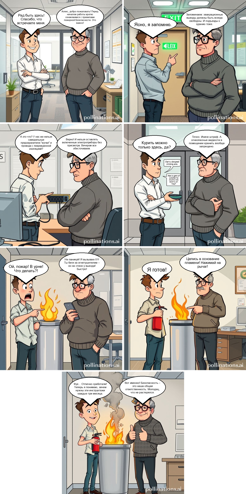

# Doc2Comix

The project was implemented as part of the True Engineering hackathon. Case study: turn a document into a comix book while preserving its meaning. 

## Realization
We have implemented a **multi-agent** system that generates a scenario according to the "author-critic" scheme, and then transmits it to the diffusion model to generate images. To determine the coordinates of clouds with text, we use a face detector.

## Inference
You can use Document2Comix in the [telegram bot](https://t.me/docs_to_comics_bot).

## Expamle

[Document](./data/Правила%20записи%20иа%20первичный%20прием,%20ЦПК%20ФТС.pdf)

